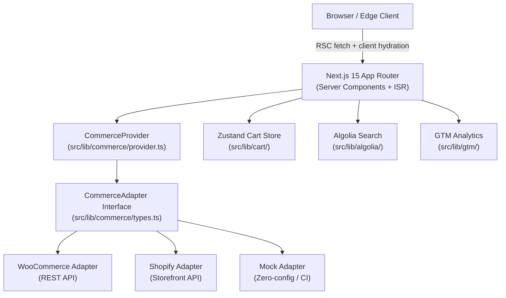

# Next.js 16 Headless Storefront

[](https://github.com/your-org/nextjs-headless-storefront/actions/workflows/ci.yml)
[](https://www.typescriptlang.org/)
[](https://nextjs.org/)
[](LICENSE)
[](https://pnpm.io/)

A production-ready headless e-commerce storefront built on Next.js 15 App Router with a swap-ready commerce adapter pattern supporting WooCommerce, Shopify, and a zero-config mock provider for local development.

## Architecture



## Quick Start

```bash
# Zero-config local dev — no external services required
COMMERCE_PROVIDER=mock pnpm dev

# WooCommerce
cp .env.example .env.local
# Fill in WOOCOMMERCE_URL, WOOCOMMERCE_KEY, WOOCOMMERCE_SECRET
COMMERCE_PROVIDER=woocommerce pnpm dev

# Shopify
# Fill in SHOPIFY_STORE_DOMAIN, SHOPIFY_STOREFRONT_ACCESS_TOKEN
COMMERCE_PROVIDER=shopify pnpm dev
```

Open [http://localhost:3000](http://localhost:3000).

## Commerce Providers

| Provider | Env var | Required env keys |
|----------|---------|-------------------|
| Mock (default) | `COMMERCE_PROVIDER=mock` | None |
| WooCommerce | `COMMERCE_PROVIDER=woocommerce` | `WOOCOMMERCE_URL`, `WOOCOMMERCE_KEY`, `WOOCOMMERCE_SECRET` |
| Shopify | `COMMERCE_PROVIDER=shopify` | `SHOPIFY_STORE_DOMAIN`, `SHOPIFY_STOREFRONT_ACCESS_TOKEN` |

Switching providers requires only changing `COMMERCE_PROVIDER` — no code changes. See [docs/COMMERCE-ADAPTERS.md](docs/COMMERCE-ADAPTERS.md) for how to add a new provider.

## Tech Stack

| Layer | Technology |
|-------|-----------|
| Framework | Next.js 15 App Router, React 19 |
| Language | TypeScript 5.7 (strict) |
| Styling | Tailwind CSS 3 |
| State | Zustand 5 (cart) |
| Validation | Zod 3 |
| Search | Algolia InstantSearch |
| Analytics | Google Tag Manager |
| Testing | Vitest 2, Playwright 1.49, MSW 2 |
| Linting | Biome |
| CI | GitHub Actions |
| Container | Docker / docker-compose |

## Features

- App Router with React Server Components and streaming SSR
- ISR (Incremental Static Regeneration) for product and category pages
- Adapter pattern — swap commerce backends without touching UI code
- Zustand cart with localStorage persistence
- Algolia search with InstantSearch UI
- GTM analytics with e-commerce event layer
- WCAG AA accessibility baseline
- Mock provider runs entirely in-process — zero external calls in CI
- Full TypeScript strict mode with Zod runtime validation
- Biome for lint + format in a single pass
- Docker + docker-compose for containerized deployments

## Project Structure

```
src/
  app/              # Next.js App Router pages and layouts
  components/       # Shared UI components
  hooks/            # Custom React hooks
  lib/
    algolia/        # Algolia search client + hooks
    cart/           # Zustand cart store
    commerce/       # Adapter pattern core
      types.ts      # CommerceAdapter interface
      provider.ts   # Runtime provider resolution
      mock/         # Mock adapter
      woocommerce/  # WooCommerce REST adapter
      shopify/      # Shopify Storefront adapter
    gtm/            # GTM data layer helpers
  mocks/            # MSW request handlers for tests
  __tests__/        # Unit + integration tests
tests/              # Playwright e2e tests
docs/               # Architecture and developer docs
```

## Documentation

- [Architecture](docs/ARCHITECTURE.md)
- [Testing](docs/TESTING.md)
- [Commerce Adapters](docs/COMMERCE-ADAPTERS.md)

## Scripts

```bash
pnpm dev              # Mock provider, Turbopack
pnpm dev:woo          # WooCommerce provider
pnpm dev:shopify      # Shopify provider
pnpm build            # Production build
pnpm typecheck        # tsc --noEmit
pnpm lint             # Biome check
pnpm lint:fix         # Biome check --write
pnpm test             # Vitest (all)
pnpm test:coverage    # Vitest with v8 coverage
pnpm test:e2e         # Playwright
```

## License

MIT
